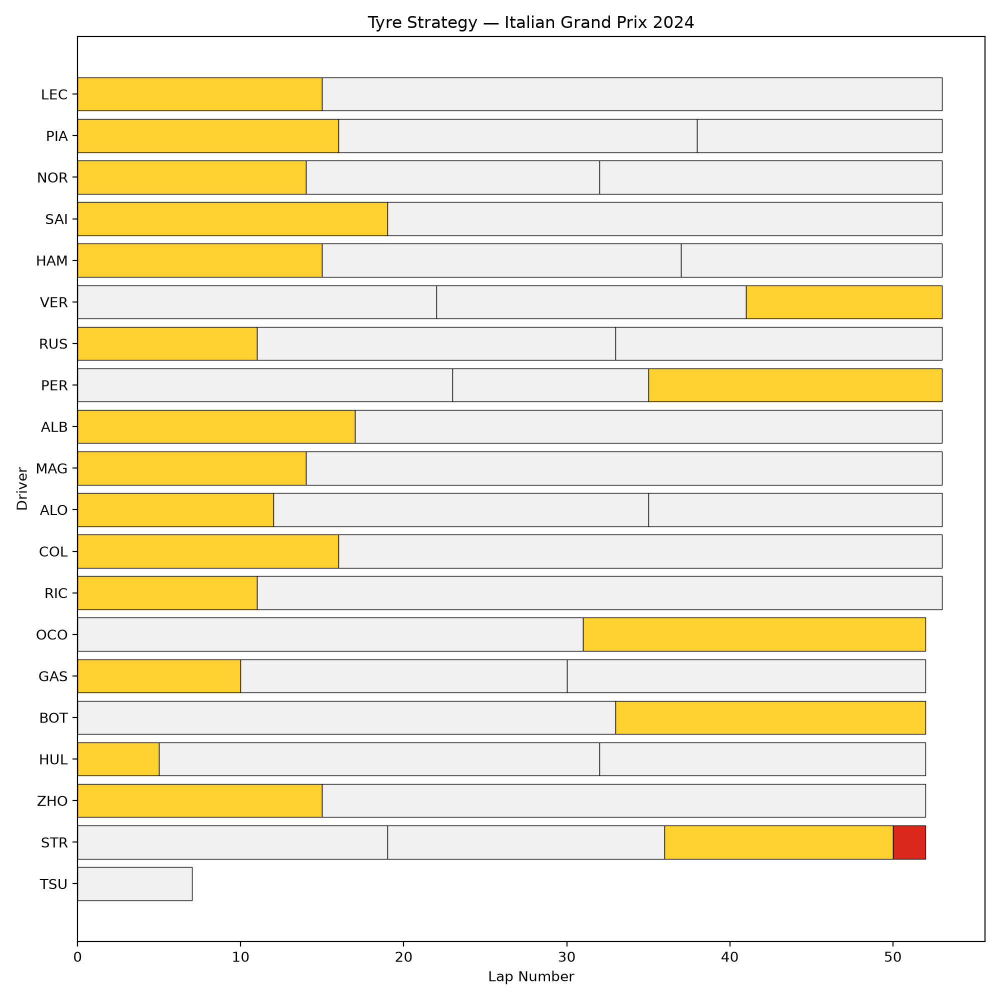
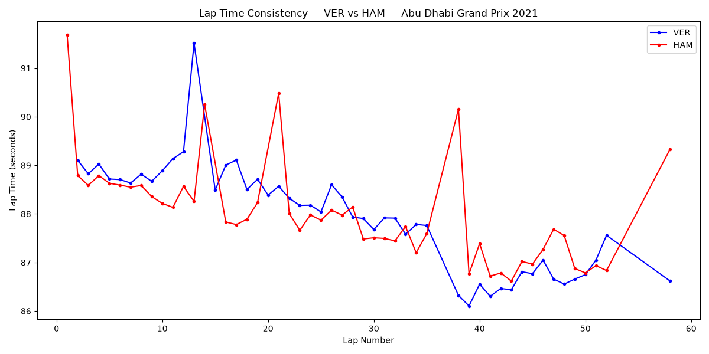
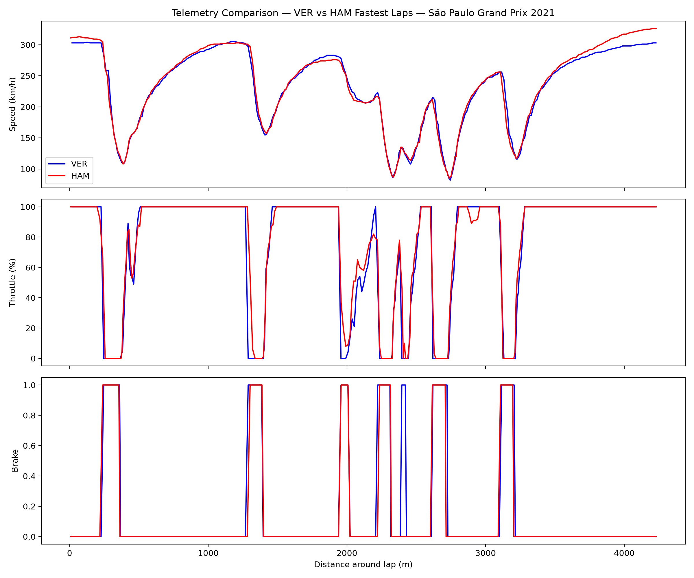

# f1-data-analysis
F1 race data analysis using FastF1 and Python
# F1 Data Analysis

A set of Python projects analyzing real Formula 1 race data using the [FastF1](https://docs.fastf1.dev) library. Built to explore race strategy and performance analysis as part of my journey into motorsport engineering.

## Projects

### 1. Tyre Strategy Chart
`tyre_strategy.py`

Visualizes each driver's tyre compound and stint length across a race, showing pit strategy at a glance — who stopped once, who gambled on two stops, and how compound choices played out.

### 2. Lap Time Consistency
`lap_time_consistency.py`

Compares two drivers' lap times across a full race to analyze pace and consistency — who degraded faster, who held a tighter, more repeatable pace, and what that suggests about tyre management or driving style.

### 3. Telemetry Overlay
`telemetry_overlay.py`

Overlays two drivers' fastest laps (speed, throttle, brake) against distance around the track, pinpointing exactly where one driver gained or lost time on the other.

## Tools used
- Python
- [FastF1](https://docs.fastf1.dev) — official F1 timing and telemetry data
- pandas
- matplotlib

## How to run
Each script can be run independently. Install dependencies first:

\`\`\`
pip install fastf1 pandas matplotlib
\`\`\`

Then run any script, e.g.:

\`\`\`
python tyre_strategy.py
\`\`\`

Edit the `driver_1`, `driver_2`, and race/year variables near the top of each file to analyze a different session.

## About me
Industrial Engineering student aiming for a career in race engineering and performance analysis. email: adrielle.cupido@gmail.com
